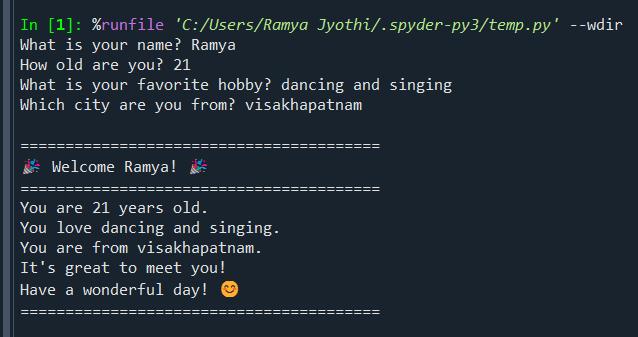

Here's a polished and complete **README.md** that fully aligns with the project requirements and includes the requested **Technical Details** section.

# Personal Introduction Program

## Project Overview

This project is a beginner-friendly Python application that collects personal information from the user and displays a friendly welcome message.

The program demonstrates:

* User input using `input()`
* Variable creation and storage
* Output using `print()`
* String formatting using f-strings

## Objectives

* Learn Python basics
* Understand user interaction
* Practice variables and data types
* Create formatted output

---

## Setup Instructions

### Prerequisites

* Python 3.x installed on your system

### Installation

1. Clone the repository

```bash
git clone https://github.com/ramyajyothi-bammidi/Personal-Introduction-Program.git
```

2. Navigate to the project folder

```bash
cd Personal-Introduction-Program
```

3. Run the program

```bash
python personal_intro.py
```

---

## Project Structure

```text
Personal-Introduction-Program/
│
├── README.md
├── personal_intro.py
├── requirements.txt
└── screenshot.png
```

---

## Features

* Collects user information through keyboard input.
* Stores information using variables.
* Uses multiple input questions.
* Generates a personalized welcome message.
* Demonstrates fundamental Python programming concepts.

---

## Code Explanation

The program performs the following steps:

1. Collects the user's name.
2. Collects the user's age.
3. Collects the user's favorite hobby.
4. Collects the user's city.
5. Stores the information in variables.
6. Displays a personalized welcome message.

### Concepts Used

* Variables
* Input Function
* Print Function
* f-Strings
* Basic Formatting

---

## Algorithm

### Step-by-Step Process

1. Ask the user for their name.
2. Ask the user for their age.
3. Ask the user for their favorite hobby.
4. Ask the user for their city.
5. Store all inputs in variables.
6. Generate a personalized welcome message.
7. Display the formatted output.

---

## Technical Details

### Programming Language

* Python 3.x

### Architecture

The application follows a simple sequential execution model:

1. Accept user input using the `input()` function.
2. Store the entered values in variables.
3. Process and organize the collected information.
4. Display a personalized welcome message using f-strings.

### Data Structures

The program uses basic Python variables to store user information.

| Variable | Data Type | Purpose                          |
| -------- | --------- | -------------------------------- |
| name     | String    | Stores the user's name           |
| age      | String    | Stores the user's age            |
| hobby    | String    | Stores the user's favorite hobby |
| city     | String    | Stores the user's city           |

### Functions and Features Used

#### input()

Used to collect information from the user through the keyboard.

#### print()

Used to display information and welcome messages on the screen.

#### f-Strings

Used to format and personalize the output message.

### Program Flow

```text
Start
  ↓
Get User Name
  ↓
Get User Age
  ↓
Get User Hobby
  ↓
Get User City
  ↓
Store Data in Variables
  ↓
Generate Welcome Message
  ↓
Display Output
  ↓
End
```

### Complexity Analysis

* Time Complexity: O(1)
* Space Complexity: O(1)

The program performs a fixed number of operations and stores a fixed amount of data, making both time and memory usage constant.

---

## Testing Evidence

### Test Case 1

#### Input

```text
Name: Ramya
Age: 21
Hobby: Dancing and Singing
City: Visakhapatnam
```

#### Output

```text
Welcome Ramya!
You are 21 years old.
You love Dancing and Singing.
You are from Visakhapatnam.
It's great to meet you.
Have a wonderful day.
```

**Result:** Passed ✅

### Test Case 2

#### Input

```text
Name: Alex
Age: 20
Hobby: Coding
City: Hyderabad
```

#### Output

```text
Welcome Alex!
You are 20 years old.
You love Coding.
You are from Hyderabad.
It's great to meet you.
Have a wonderful day.
```

**Result:** Passed ✅

---

## What I Learned

Through this project, I learned:

* How to take input from users using `input()`.
* How to store data in variables.
* How to display output using `print()`.
* How to use f-strings for formatting.
* Basic Python programming workflow.
* How to organize a project repository on GitHub.
* The importance of documentation and testing.

---

## Screenshot



---

## Requirements

This project uses only Python built-in functions.

Contents of `requirements.txt`:

```text
# No external dependencies required
```

---

## Future Improvements

Possible enhancements include:

* Input validation for age.
* Additional user questions.
* Error handling for invalid input.
* Graphical User Interface (GUI) version using Tkinter.
* Saving user information to a file.

---

## Author

**Bammidi Ramya Jyothi**

M.Sc. Artificial Intelligence and Data Science

Central University of Andhra Pradesh


